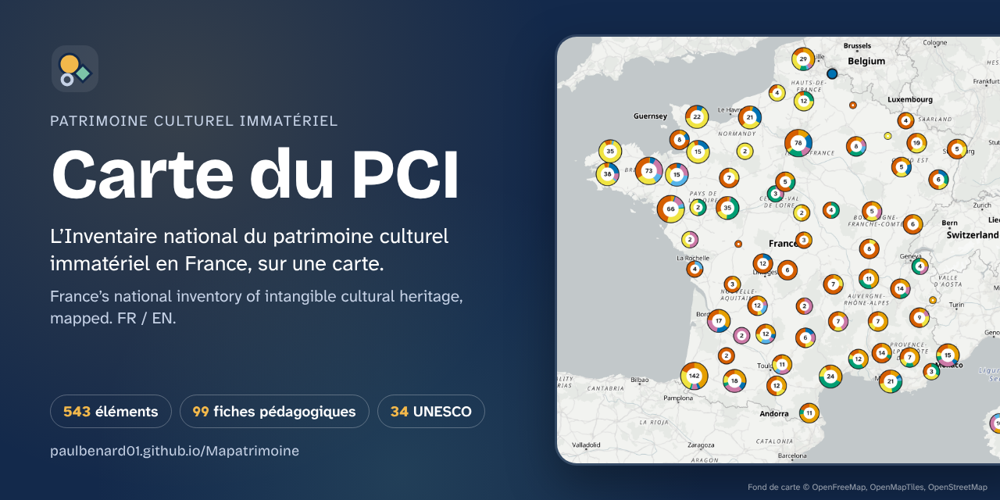

# PCI Map / Carte du PCI

[](https://paulbenard01.github.io/Mapatrimoine/)

## English

An interactive, bilingual (FR/EN) map and catalogue of France's national **Inventaire du patrimoine culturel immatériel** (PCI), the official inventory of intangible cultural heritage kept by the Ministère de la Culture.

- **Inventory** (default view): all 543 published elements, searchable (titles and summaries, in French or English) and filterable by theme, **every one placed on the map** (several pins when an element lives in several places) with a picture where one could be found, each linking to its official fiche and, for all but a few, a short own-words summary (FR/EN). 76 elements are documented in detail with timing and evidence.
- **Places** come from the fiche's "Localisation" field as published on [PCI Lab](https://www.pci-lab.fr) (the ministry's online edition of the inventory) or from the fiche itself, read online; each element's sources are linked. Practices with no specific place get a single "France entière" pin marked approximate.
- **Pictures** (530 of 543 elements): Wikimedia Commons files with their author and licence, else the fiche image shown on PCI Lab (linked from pci-lab.fr), else a photo taken from the fiche itself, credited to it.
- **Yearly events** (secondary view): the 71 documented events, with a "next occurrence" badge (including movable feasts such as Good Friday, computed from Easter), a 12-month strip and a "this month" filter. Every date shows its evidence: a short quote from the fiche with its page, and/or the organiser or tourism pages checked online (with the date checked), a confidence level, and the disclaimer: *typical timing from the official inventory; confirm exact dates with the organisers.*
- **Announced dates**: for documented events, the dates tourist offices list in [DATAtourisme](https://www.datatourisme.fr) (open data, refreshed daily at build time).
- **UNESCO**: the 34 inventory elements that are (part of) one of France's 30 UNESCO inscriptions carry a UNESCO tag and a filter.
- **Resources**: printable bilingual worksheets (summary, picture, places, dates, discussion questions, vocabulary); the ones for UNESCO elements are extended with history, the meaning of the inscription and a classroom activity.
- **Guided stories**: tours that fly the map from one element to the next around an idea (giants and totem animals, fire, crafts, voices) or a place (Pays basque, Flanders, overseas France, Paris and its diasporas).
- **Lessons**: one ready-to-teach, one-hour lesson per level (primary, lower and upper secondary, university), printable.
- **Listen, watch**: links to recordings and films held by public archives (UNESCO, INA, Dastum, Occitanica...).
- **Open data**: the whole map as CSV and JSON, at the bottom of the Resources page.
- On phones, a bottom bar switches between Explore (map), Search, Near me, Agenda and Resources.
- Map with clusters drawn as donut charts of their themes; events are circles, practices diamonds and not-yet-documented elements rings, coloured by theme (colour-blind-safe palette). "Near me" works on the device only; metropolitan France / overseas switch; shareable URLs; keyboard accessible.
- Privacy: no cookies, analytics or trackers. Map tiles come from [OpenFreeMap](https://openfreemap.org) and pictures from Wikimedia and PCI Lab; those servers see visitors' IP addresses.

Independent portfolio and cultural-mediation project by Paul Benard (Master's in cultural heritage management, Paris 1 Panthéon-Sorbonne). Not affiliated with the Ministère de la Culture. Data notice: [`DATA_NOTICE.md`](DATA_NOTICE.md). Code: MIT. Roadmap: [`PLAN.md`](PLAN.md). Decisions: [`docs/decisions.md`](docs/decisions.md).

### Run it

Requirements: Python 3.11+, Node 22, and `pdftotext` (poppler) for text extraction (pypdf is the fallback).

```sh
# data pipeline
python3 -m venv .venv && .venv/bin/pip install -e '.[dev]'
.venv/bin/pci fetch-index     # inventory page + official list PDF -> data/index.json
.venv/bin/pci fetch-pcilab    # PCI Lab points + fiche localisations -> data/raw/pcilab.json (local, for writing data/places.yaml)
.venv/bin/pci fetch-fiches    # pilot fiches (data/pilot.txt) -> data/raw/ (git-ignored, cached, 1 request / 5 s)
.venv/bin/pci extract-text    # -> data/text/ (git-ignored)
.venv/bin/pci geocode         # curated + data/places.yaml places -> data/geocode-cache.json (geo.api.gouv.fr)
.venv/bin/pci build           # validate data/curated, places, images, summaries, mediation sheets -> web/public/data/*.json
.venv/bin/pci review          # coverage and review checklist -> docs/review.md
.venv/bin/pci fetch-datatourisme && .venv/bin/pci announced   # announced dates -> web/public/data/announced.json
.venv/bin/pytest -q && .venv/bin/ruff check . && .venv/bin/ruff format --check .

# website
cd web
npm ci
npm run dev                   # http://localhost:5173 (add ?today=2026-10-08 to pin the clock)
npm test                      # vitest
npm run build                 # type-check + production build in web/dist
npm run preview &             # serve the build on :4173, then:
npm run screenshots           # Playwright screenshots in docs/screenshots + keyboard-only smoke test
```

The committed data (`data/index.json`, `data/curated/`, `data/places.yaml`, `data/images.yaml`, `data/geocode-cache.json`, `web/public/data/`) is enough to build the site offline; the fetch commands are only needed to refresh or extend it. See [`CLAUDE.md`](CLAUDE.md) for the curation workflow.

### Deploy

`.github/workflows/pages.yml` builds `web/` and publishes it to GitHub Pages on every push to `main`, and daily to refresh announced dates. One-time setup: repository **Settings → Pages → Source: GitHub Actions**.

## Français

Une carte et un catalogue interactifs et bilingues (FR/EN) de l'**Inventaire national du patrimoine culturel immatériel** (PCI) tenu par le ministère de la Culture.

- **Inventaire** (vue par défaut) : les 543 éléments publiés, avec recherche et filtre par domaine, **tous placés sur la carte** (plusieurs points quand un élément vit en plusieurs lieux), illustrés quand une image a pu être trouvée, chacun renvoyant à sa fiche officielle et, à quelques exceptions près, accompagné d'un court résumé rédigé par nos soins (FR/EN). 76 éléments sont documentés en détail, avec calendrier et sources.
- **Lieux** : d'après le champ « Localisation » de la fiche publié sur [PCI Lab](https://www.pci-lab.fr) (l'édition en ligne de l'Inventaire par le ministère) ou d'après la fiche elle-même, lue en ligne ; les sources de chaque élément sont citées. Les pratiques sans lieu précis ont un seul point « France entière », signalé comme approximatif.
- **Images** (530 éléments sur 543) : fichiers Wikimedia Commons avec auteur et licence, sinon l'image de la fiche affichée depuis PCI Lab (liée), sinon une photo tirée de la fiche elle-même, créditée.
- **Agenda annuel** (vue secondaire) : les 71 événements documentés, avec la prochaine occurrence (y compris les fêtes mobiles comme le Vendredi saint, calculées depuis Pâques), une frise des 12 mois et un filtre « ce mois-ci ». Chaque date affiche ses sources : citation courte de la fiche avec sa page et/ou pages d'organisateurs ou d'offices de tourisme consultées en ligne (avec la date de consultation), un niveau de fiabilité et l'avertissement : *dates indicatives tirées de l'Inventaire national ; vérifiez les dates exactes auprès des organisateurs.*
- **Dates annoncées** : pour les événements documentés, les dates publiées par les offices de tourisme dans [DATAtourisme](https://www.datatourisme.fr) (données ouvertes, mises à jour chaque jour à la construction du site).
- **UNESCO** : les 34 éléments de l'Inventaire qui relèvent de l'une des 30 inscriptions de la France à l'UNESCO portent un repère UNESCO et peuvent être filtrés.
- **Ressources** : des fiches de travail bilingues imprimables (résumé, image, lieux, dates, questions, vocabulaire) ; celles des éléments inscrits à l'UNESCO sont enrichies (histoire, sens de l'inscription, activité pour la classe).
- **Parcours guidés** : la carte vous emmène d'un élément à l'autre autour d'une idée (géants et animaux totems, le feu, les savoir-faire, les voix) ou d'un territoire (Pays basque, Flandre, outre-mer, Paris des diasporas).
- **Séances** : une séance d'une heure clé en main par niveau (primaire, collège, lycée, université), imprimable.
- **Écouter, regarder** : des liens vers les enregistrements et films conservés par des archives publiques (UNESCO, INA, Dastum, Occitanica…).
- **Données ouvertes** : toute la carte en CSV et JSON, en bas de la page Ressources.
- Sur téléphone, une barre en bas de l'écran donne accès à Explorer (carte), Rechercher, Autour de moi, Agenda et Ressources.
- Carte avec regroupements dessinés en anneaux par domaine ; événements en cercles, pratiques en losanges, éléments pas encore documentés en anneaux, couleur par domaine (palette adaptée au daltonisme). « Autour de moi » est calculé uniquement sur l'appareil ; bascule France métropolitaine / outre-mer ; adresses partageables ; utilisable au clavier.
- Confidentialité : ni cookie, ni mesure d'audience, ni traceur. Les fonds de carte viennent d'[OpenFreeMap](https://openfreemap.org) et les images de Wikimedia et de PCI Lab ; ces serveurs voient l'adresse IP des visiteurs.

Projet indépendant de portfolio et de médiation culturelle de Paul Benard (master de gestion du patrimoine culturel, Paris 1 Panthéon-Sorbonne), sans lien avec le ministère de la Culture. Données : voir [`DATA_NOTICE.md`](DATA_NOTICE.md). Code : licence MIT. Les commandes ci-dessus (section anglaise) installent, testent et construisent le projet ; le déploiement GitHub Pages s'active dans **Settings → Pages → Source : GitHub Actions**.
